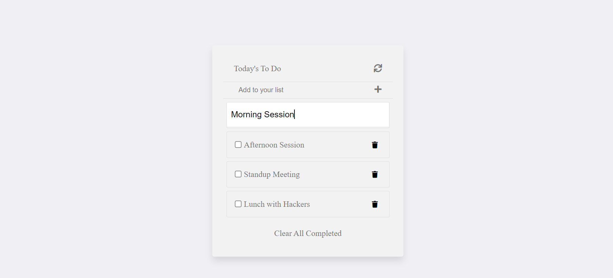

# To-Do-List App

This is my to-do list website built with html, css and JavaScript. In this project I used Webpack to bundle JavaScript and ES6 modules to write modular JavaScript.



## Built With

- Webpack
- HTML
- CSS
- Modular JavaScript (with modern ES6 syntax)


## Getting Started

**Setup**

Execute the following commands on your terminal
```
npm install
npm start
```

### Deployment

Execute the following commands on your terminal

```
npm run build
npm run deploy
```

It will open your browser with the project homepage
